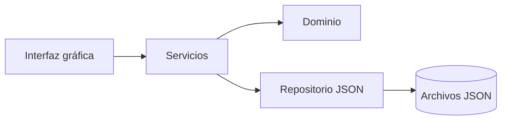

# Arquitectura

El sistema usa arquitectura por capas.

## Dominio
Entidades: Paciente, Médico, Cita e Historia clínica.

## Servicios
Reglas de negocio:
- DNI y CMP únicos.
- Médico asociado a especialidad.
- Citas no permitidas en fechas pasadas.
- Sin cruces de horario para médico o paciente.
- Estados: PROGRAMADA, ATENDIDA y CANCELADA.
- Historia clínica solo para cita ATENDIDA.

## Persistencia
Archivos JSON en `data/`.

## Interfaz
CustomTkinter + ttk.Treeview + Matplotlib + tkcalendar.
